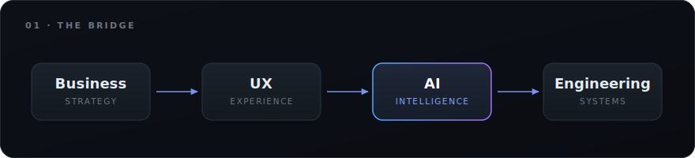
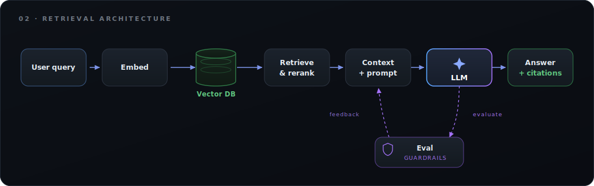
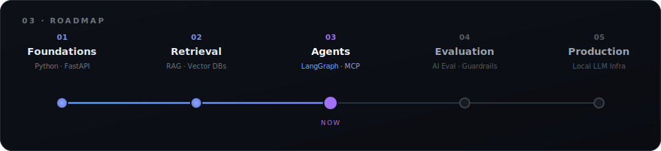

<!--
  ─────────────────────────────────────────────────────────────
  README de perfil · José Luis
  Antes de publicar, reemplaza los marcadores entre {{ }}:
    JLC0DER   → tu usuario de GitHub
    jose-luis-sanchez-espada   → la parte final de tu URL de LinkedIn (linkedin.com/in/XXXX)
    https://joseluisproducts.framer.website/  → la URL de tu portfolio
     joseluissanchezproduct@gmail.com     → tu correo
    {{X}}          → tu usuario de X/Twitter (opcional)
  ─────────────────────────────────────────────────────────────
-->

José Luis

 

  <strong>11+ years</strong> in Product Design&nbsp;&nbsp;·&nbsp;&nbsp;Banking&nbsp;&nbsp;·&nbsp;&nbsp;Government&nbsp;&nbsp;·&nbsp;&nbsp;Enterprise&nbsp;&nbsp;·&nbsp;&nbsp;Design Systems
   
  <em>Now building at the intersection of product and AI engineering.</em>

  
  
  
  

 

The bridge I build on

I don't sit inside a single discipline. I connect them — from the business problem all the way down to the running system.

  

Most people own one of those boxes. My work is the arrows between them.

 
About

I'm a Lead Product Designer with more than a decade shaping enterprise software for banking, fintech and government, across Europe and the Middle East. My focus has long been the hard end of design: complex domains, design systems and products that have to hold up at scale.

For the last stretch I've been moving deliberately into AI engineering — not to become "just another AI engineer," but to design and build complete AI systems from both the product and the engineering side. I care as much about retrieval architecture, evaluation and infrastructure as I do about the interface in front of it.

 
Featured projects

ProjectWhat it doesAI Regulatory & Banking Intelligence PlatformA Retrieval-Augmented Generation platform that answers banking and regulatory questions with explainable, source-grounded citations.Banking AI CopilotA conversational assistant for banking products — transfers, loans, cards, payments and financial insights.AI Portfolio Review AgentAn agent that analyses Product Design portfolios and generates personalised, structured recommendations.Local AI InfrastructureA fully local AI stack on Mac Studio — Ollama, open-source LLMs, vector databases and private RAG systems.

 
How I think about an AI system

The pattern behind most of my work — retrieval grounded in real sources, with citations as a first-class output, not an afterthought.

  

 
Current focus

Right now I'm going deep on the engineering layer of AI products:

Mostrar imagen
Mostrar imagen
Mostrar imagen
Mostrar imagen
Mostrar imagen
Mostrar imagen
Mostrar imagen

 
Learning roadmap

A systems view of where I'm heading — foundations to production.

  

 
Tech stack

AI & LLMs

Mostrar imagen
Mostrar imagen
Mostrar imagen
Mostrar imagen
Mostrar imagen
Mostrar imagen
Mostrar imagen
Mostrar imagen

Backend & data

Mostrar imagen
Mostrar imagen
Mostrar imagen
Mostrar imagen

Frontend

Mostrar imagen
Mostrar imagen
Mostrar imagen
Mostrar imagen

Design & tooling

Mostrar imagen
Mostrar imagen
Mostrar imagen
Mostrar imagen

 
GitHub

 
Research interests

Enterprise AI · RAG · Agentic AI · LLM evaluation · Knowledge retrieval · AI UX · Human–AI interaction · Design systems · Developer experience · AI infrastructure

 

I like understanding how things work all the way down — architectures, AI workflows, the engineering underneath the interface.

  

